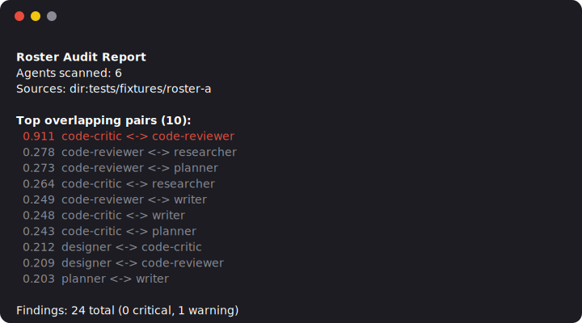

# roster

Does your agent earn its context?



`roster audit` also renders a shareable HTML report with `--html` — [view a live sample report](https://sshworld.github.io/roster/demo/report.html).

## Philosophy

Most agent tooling optimizes personas — tone, role-play, instructions. roster
starts from a different premise: **structure earns value, not persona**. An
agent's context is a dependency, and dependencies churn — they overlap,
route badly, cost tokens, and rot. roster is a static analyzer for your agent
roster (skills, subagents, tool configs) that surfaces those problems before
they burn context in production.

## Install

```sh
npm i -g roster-cli
```

or run it without installing:

```sh
npx roster-cli audit <dir>
```

## Usage

roster is one binary with three commands: `audit`, `doccheck`, and `usage`.

```sh
roster audit <dir>
roster audit <dir> --user
roster audit <dir> --repo owner/name
roster audit <dir> --html report.html
roster audit --plugin --enabled-only
roster doccheck README.md
roster usage --days 14 --user
```

Full flag surface for `audit`:

```
roster audit <dir> [--json] [--html <out>] [--user] [--plugin [name]]
                    [--enabled-only] [--repo <owner/name[@ref]>] [--top <n>]
                    [--fail-above <s>] [--no-fail]
```

`--enabled-only` (with `--plugin`) restricts the plugin-cache source to entries
active for the current project.[^enabled-only]

[^enabled-only]: Two filters, AND-combined. **Scope**: user-scope entries are
    always active; local/project-scope entries are active only when the cwd is
    inside the pinning project. **Settings**: a plugin explicitly disabled via
    `enabledPlugins` in `settings.json`/`settings.local.json` is excluded —
    checked across `<home>/.claude/`, then the nearest project directory
    at-or-above cwd that has a `.claude/settings.json`, with later files
    winning and a key absent from all of them treated as enabled. This is
    audit-path only — `usage` does not take `--enabled-only`.

## doccheck

```sh
roster doccheck README.md
roster doccheck docs/
roster doccheck            # defaults to README.md + docs/**/*.md
```

Scans fenced `sh`/`bash`/`shell` code blocks in markdown docs for commands
that would fail if a reader copy-pasted them: dead relative paths, missing
`npm run <script>` scripts, and scripts that exist on disk but lack the
executable bit.

To keep false positives at zero, it skips anything it can't verify cheaply:
absolute paths (`/plugin ...`), `npx ...` invocations, and bare global
binaries (`node`, `git`, ...) with no path separator.

Exits `1` if any finding is reported, `0` otherwise (`--json` for machine-
readable output).

## usage

```sh
roster usage
roster usage --days 14
roster usage --user
roster usage --plugin --json
```

Aggregates how often each `subagent_type` was invoked (via the Agent/Task
tool) across Claude Code transcript files under `~/.claude` (override with
`ROSTER_CLAUDE_DIR`), within the last `--days` (default `30`).

Joining with `--user` and/or `--plugin` also reports:
- **unused** — agents present in the roster with zero observed invocations
- **ghosts** — invoked `subagent_type` values that don't match any roster agent

Always exits `0` — this is a reporting tool, not a gate.

## Rules

| Rule | Description | Status |
| --- | --- | --- |
| `overlap` | Detects agents/skills covering the same responsibility | stable |
| `harness` | Flags harness-incompatible or malformed configs | stable |
| `routing` | Checks routing/trigger ambiguity between agents | stable |
| `cost` | Estimates context/token cost of a roster | stable |
| `fluff` | Flags low-signal, filler instructions | experimental |

## Benchmarks

`roster audit --repo` run against well-known public agent rosters (SHA-pinned,
reproducible via `scripts/bench.sh`). Full reports: `docs/benchmarks/`.

A weekly cron re-runs the benchmark suite against each roster's latest
upstream HEAD and opens a refresh PR with any changes.[^leaderboard-cron]

<!-- bench:start -->
| Repo | Agents | Top overlap pair | No-tools % | Fixed cost |
| --- | --- | --- | --- | --- |
| [contains-studio/agents](https://github.com/contains-studio/agents) | 37 | content-creator <-> instagram-curator (0.565) | 16.2% | ~8421 tokens/turn |
| [msitarzewski/agency-agents](https://github.com/msitarzewski/agency-agents) | 277 | Backend Architect <-> Backend Architect (0.878) | 93.9% | ~14024 tokens/turn |
| [wshobson/agents](https://github.com/wshobson/agents) | 691 | api-scaffolding-backend-architect <-> backend-api-security-backend-architect (1.000) | 97.8% | ~24853 tokens/turn |
<!-- bench:end -->

[^leaderboard-cron]: Runs every Monday via `.github/workflows/leaderboard.yml`.
    GitHub automatically disables scheduled workflows after 60 days of repo
    inactivity — re-enable with a manual `workflow_dispatch` run if that
    happens.

Several top pairs score at or near 1.000 similarity (e.g. wshobson/agents has
five pairs at a perfect 1.000) — these are near-duplicate agent files (same
description/body reused across roles), not incidental topic overlap.

## Use as a Claude Code plugin

roster also ships as a Claude Code plugin — a resident guard instead of a
one-off report.

Install via the bundled marketplace manifest:

```sh
/plugin marketplace add sshworld/roster
/plugin install roster
```

Once installed:

- **`roster-audit` skill** — triggers when you ask to audit an agent roster
  (overlap, missing harness/tools, routing ambiguity, cost); runs the bundled
  CLI and explains how to read the findings.
- **`roster-cleanup` skill** — triggers when you ask to clean up, prune, or
  merge agents. Audits, classifies findings into concrete actions (delete /
  move / merge / rename / uninstall / narrow tools), asks you to approve each
  destructive step, executes only what you approved, then re-audits and
  reports the delta.
- **`roster-drift.sh` hook** (`SessionStart`) — on each session, diffs the
  watched agent-md dir(s) against a cached snapshot and emits a short
  advisory if agents were added/removed/changed
  (`ROSTER_DRIFT_DISABLE=1` to opt out). By default it watches
  `.claude/agents` plus, in a plugin-layout repo (one with a top-level
  `.claude-plugin/plugin.json`), the root `agents/` dir; override with
  `ROSTER_DRIFT_DIR` (colon-separated dir list). The advisory is injected
  into Claude's session context along with a relay directive, so Claude
  surfaces it to you in its first response of the session. Advisory only —
  never blocks a session.

## Contributing

See [CONTRIBUTING.md](./CONTRIBUTING.md).

## License

[MIT](./LICENSE)
